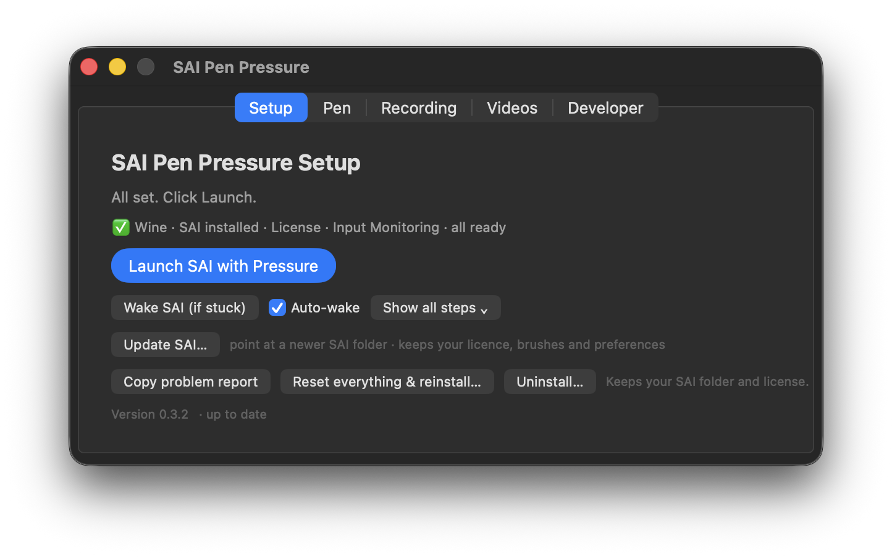
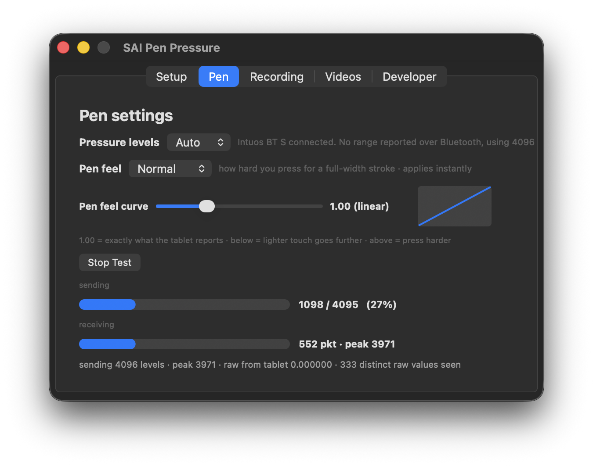
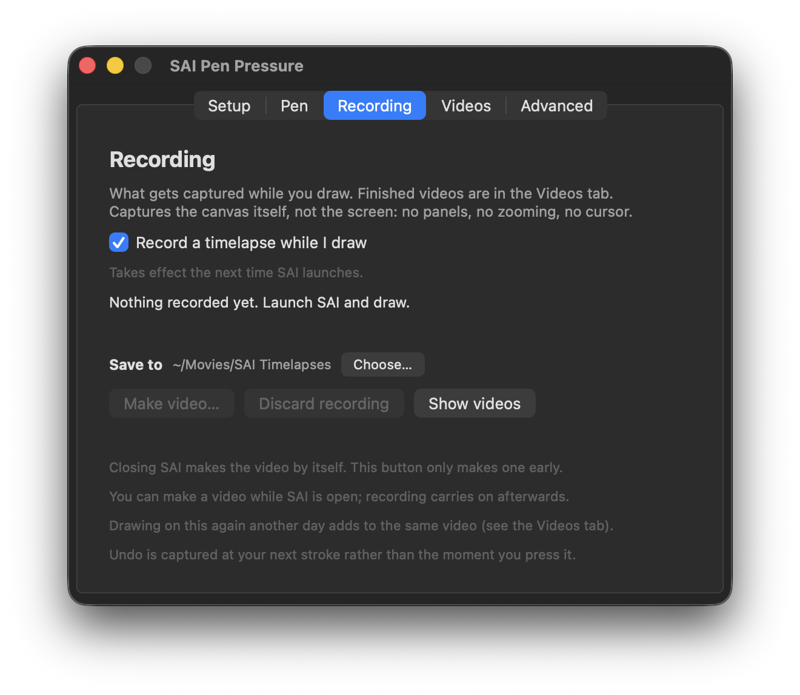
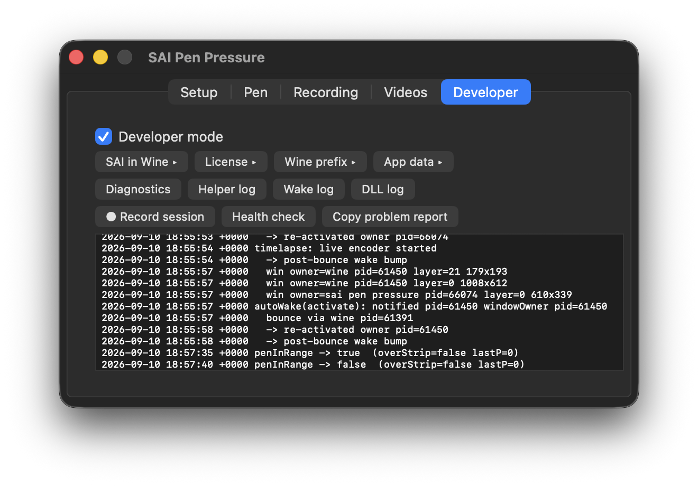

# SAI Pen Pressure on macOS

[](https://github.com/ametrien/Paint-Tool-SAI-pen-pressure-macOS-fix/actions/workflows/build.yml)
[](https://github.com/ametrien/Paint-Tool-SAI-pen-pressure-macOS-fix/releases/latest)
[](https://github.com/ametrien/Paint-Tool-SAI-pen-pressure-macOS-fix/releases)
[](LICENSE)

Run **PaintTool SAI Ver.2** on a Mac (via Wine) **with real Wacom pen pressure** — the one
thing that normally doesn't survive the trip through Wine — and **record a timelapse of your
canvas** while you draw.

macOS + Wine already run SAI and move the cursor fine, but Wine's Mac driver throws away pen
**pressure**. This project adds it back with a tiny two-part bridge:

- a **custom `wintab32.dll`** that speaks the WinTab tablet API to SAI (drop-in, no Wine rebuild), and
- a small **native macOS helper** that reads your tablet's real pressure and feeds it to that DLL.

The result: pressure-sensitive strokes that taper with how hard you press.

## What you get

**Drawing**

- **Real pen pressure** in SAI, with adjustable levels (up to 8192) and pen feel
- **Mouse and trackpad still paint normally** — no need to unplug anything
- Works across **multiple monitors**

**It behaves like a Mac app, not Windows in a box**

- **⌘Z / ⌘Y / ⌘S** and the rest, rather than Ctrl — remapped inside Wine, so SAI simply sees the right keys
- **Pinch to zoom** and **two-finger scroll to pan** on the trackpad
- **⌃⌥⌘Space** brings back a SAI window that has gone missing, and it can do that automatically when you switch back to SAI

**Canvas timelapse** *(v0.2.0+)*

- **One frame per brush stroke** — hours of drawing become a couple of minutes
- Records the **canvas, not the screen**: no panels, no cursor, and no camera lurching when you zoom or pan
- Layer opacity and blend modes come through; **several open canvases become one video each**
- Pick a target length; it encodes as you draw, so it costs megabytes rather than gigabytes

**Setup and upkeep**

- **One app, no terminal.** Wine is installed for you, with progress
- Licence handling, including the two-folders trap that silently stops SAI saving
- **Update SAI in place** when a new build lands, keeping your licence, brushes and preferences
- Reset, reinstall or uninstall from the same window; logs and a health check when something is odd

## What it looks like

Four tabs, one window.

<p align="center">
  
  
</p>
<p align="center">
  
  
</p>

**Setup** gets SAI running and tells you which of the four prerequisites are missing.
**Update SAI…** swaps in a newer SAI build without touching your licence, brushes or preferences —
useful because Ver.2 is a rolling preview.
**Pen** is pressure levels, pen feel and the response curve.
**Recording** is the canvas timelapse.
**Developer** holds the logs, a diagnostics dump and a health check.

---


> **Status:** working. Position + pressure + hover tracking + mouse coexistence all work, plus
> multi-monitor and Mac-style Cmd shortcuts. See [Limitations](#limitations).
>
> **Tested configuration:**
> - Mac: **Apple M3 Pro**, **macOS Tahoe 26.3 (25D125)**
> - SAI: **PaintTool SAI Ver.2 (64-bit)**
> - Tablet: **Wacom Intuos BT S (CTL-4100WL)**, over USB and Bluetooth
> - Displays: **single screen**, and **two screens in mirroring mode**
>
> Other tablets / Macs / display setups are untested — reports welcome (see
> [CONTRIBUTING](CONTRIBUTING.md)).

📺 **Video walkthrough:** [watch the setup tutorial](https://youtu.be/62mJwWQsEYI)

---

## Quick start — from zero to drawing

Starting with nothing but a Mac and a tablet? Follow these in order (~15 min, most of it downloads):

1. **Install your tablet's macOS driver** (e.g. Wacom's driver from wacom.com). Check the pen
   moves the cursor in any app before continuing.
2. **Download PaintTool SAI Ver.2** from https://www.systemax.jp/en/sai/devdept.html.
   Unzip it; the folder contains `sai2.exe`. *(You can draw and test pressure for free — a
   license is only needed to save; see step 7.)* Two builds are offered:
   - **SAI Ver.2 64bit — 2026-07-12 Technical Preview *Major Renovated*** (ZIP, ~3.3 MB) —
     the newest. **It has a dark theme:** *Window → Window Color → Dark Colors*. ⚠️ It also
     changed where the license certificate is read from — see step 7.
   - **Technical Preview Stable Version** — the older, more conservative build.

   Either works with this bridge; the app handles the license difference for you.
3. **Download the app** — no terminal needed. From the
   [**latest release**](https://github.com/ametrien/Paint-Tool-SAI-pen-pressure-macOS-fix/releases/latest),
   download **`SAI-Pen-Pressure-….zip`** and double-click it to unzip → you get
   **`SAI Pen Pressure.app`** (drag it to your Applications folder if you like).
   *Developers can instead `git clone` this repo and run `./make-app.sh`.*
4. **Open it.** macOS blocks unsigned apps, so: double-click the app once (it'll refuse), then go
   **System Settings → Privacy & Security**, scroll down, and click **"Open Anyway"** → confirm.
   You only do this once. *(Why the warning? see ["is this safe?"](#macos-wont-let-me-open-it--is-this-safe).)*
5. **Follow the setup window.** It checks everything and fixes each item:
   - **Install Wine** if you don't have it (downloads it, with progress) →
   - **Choose** your SAI folder from step 2 →
   - **Grant** *Input Monitoring* (the only permission needed); reopen the app if macOS asks →
   - click **Launch SAI with Pressure**.
6. **Turn on WinTab in SAI:** Others → Options → **Pen Tablet** → **Use WinTab API**, then
   relaunch SAI (reopen the app).
7. **Draw — you've got pressure!** *To save your work* you need a SAI license. SAI is
   commercial software by SYSTEMAX; this project is unaffiliated and cannot supply a license.
   - Buy one, and you'll get an email titled *"Information About Your Software License"* with a
     **License Number** and a **Certificate Download Password**.
   - In SAI, open **Others → System ID** and note the ID it shows.
   - Go to https://www.systemax.jp/en/license.html, enter the License Number, password, and your
     **System ID**, and download the `.slc` certificate.
   - In the setup app, click **Install…** on the **SAI license** row and pick that `.slc` — it's
     copied into the folder SAI actually reads, and a copy is kept so a reinstall restores it.
     Then quit SAI completely and relaunch — it reads the license only at startup.
     *(Command line: `./install.sh --install-license`.)*
   - **Why we copy it to two places.** Where SAI looks for the certificate changed between
     builds: older Ver.2 builds read it from the folder holding `sai2.exe`, while the
     **2026-07-12 Major Renovated** preview reads it from a **`settings`** folder. Getting it
     wrong looks *exactly* like an invalid license — SAI simply refuses to save, with no hint
     that the file is merely in the wrong folder. A certificate is 128 bytes, so the app writes
     both and whichever build you run finds its own:
     ```
     ~/SAI2-pressure/drive_c/SAI2/sai-….slc
     ~/SAI2-pressure/drive_c/SAI2/settings/sai-….slc
     ```
   - Dropping the `.slc` into **your own** SAI folder does nothing — that folder is only a
     source that gets copied in at install time. *(The certificate is tied to your System ID; if
     you rebuild the Wine prefix and the ID changes, re-download it from the same page.)*

That's it. The sections below explain the pieces, the manual (command-line) route, and options.

> Prefer video? There's a [step-by-step tutorial](https://youtu.be/62mJwWQsEYI) covering this
> same quick-start flow.

---

## What you need to bring

This tool **can't** bundle everything — two pieces are legally yours to provide:

| You provide | Where |
|---|---|
| **PaintTool SAI Ver.2** (free technical preview, 64-bit ZIP) | https://www.systemax.jp/en/sai/devdept.html |
| **A SAI license** — only needed to *save* your work | https://www.systemax.jp/en/license.html (you can draw & test pressure without it) |
| **A tablet + its macOS driver** | e.g. Wacom driver from wacom.com |
| **Wine** (Gcenx "Wine Staging" build) | https://github.com/Gcenx/macOS_Wine_builds/releases |

This project provides the **pressure bridge** (the DLL + helper) and an **installer** that wires
it all together.

---

## Easiest: the app (recommended)

**Download `SAI Pen Pressure.app`** from the
[latest release](https://github.com/ametrien/Paint-Tool-SAI-pen-pressure-macOS-fix/releases/latest)
(no terminal needed) — or build it yourself with `./make-app.sh`. Then:

1. **First launch:** double-click it → macOS blocks it → **System Settings → Privacy & Security →
   "Open Anyway"** (it's unsigned; [why?](#macos-wont-let-me-open-it--is-this-safe)).
2. It **asks for your SAI Ver.2 folder** (the one containing `sai2.exe`), then sets up the
   Wine prefix and installs the bridge.
3. **Grant Input Monitoring — you'll need to add the app by hand.** This is what reads your
   tablet's pressure, and it's the **only** permission the app needs. (Mac-style **Cmd+Z / Cmd+S**
   etc. are handled by Wine itself — no Accessibility permission required.)

   **macOS will not show a prompt for it.** Downloaded releases are ad-hoc signed — signing them
   properly needs a paid Apple Developer Program membership, which this free project doesn't have
   — and macOS only prompts for apps with a stable signing identity. So it has to be added
   manually, once:

   - click **Grant…** in the setup window (it opens the right pane, reveals the app in Finder,
     and copies its path to your clipboard), then
   - in **System Settings → Privacy & Security → Input Monitoring**, click **+**,
   - press **⇧⌘G**, paste (**⌘V**), choose the app, and switch it **on**.

   *Tip:* move the app to **/Applications** first and grant it there. The grant is matched by
   path, so moving the app afterwards means doing this again. Building from source on a Mac that
   has an Apple Development certificate avoids the whole dance — `make-app.sh` signs
   automatically and macOS then prompts normally. See issue #23.
4. **⚠️ Quit and reopen the app.** macOS only applies this permission on a **fresh launch** —
   the first run *won't have pressure* until you restart the app. You only do this once; after
   that, double-clicking the app just works.

You still bring your own Wine (in `/Applications`), SAI, and license (drop your `.slc` into
the prefix's `SAI2` folder and restart SAI). The manual route below does the same thing if you
prefer the command line.

### "macOS won't let me open it / is this safe?"

macOS shows an "unidentified developer" warning because signing an app so Gatekeeper trusts it
requires a **paid Apple Developer account (~$100/year)**, which this free project doesn't have.
So you allow it yourself: double-click the app once (macOS refuses), then go **System Settings →
Privacy & Security**, scroll down, and click **"Open Anyway"**. (On older macOS, right-click the
app → **Open** also works.)

And if you have doubts — **you should!** — this whole thing is **open source**. Read the code
before you run it: the entire bridge is a small `wintab32.dll` (C) and one Swift helper, right
here in this repo. Don't run tools you can't inspect.

---

## Install (step by step, manual)

1. **Install Wine.** Download `wine-staging-*-osx64.tar.xz` (or the `.app`) from the
   [Gcenx releases](https://github.com/Gcenx/macOS_Wine_builds/releases) and put
   **Wine Staging.app** in `/Applications`.

2. **Download & unzip SAI Ver.2** from systemax. Note the folder that contains `sai2.exe`.

3. **Run the installer** (from this repo):
   ```bash
   ./install.sh
   ```
   It creates a Wine prefix, copies SAI into it, installs the custom `wintab32.dll`, sets the
   DLL override, and generates your personal one-click launcher. It will ask where your SAI
   folder is (or set `SAI2_SRC=/path/to/sai2-folder ./install.sh`).

4. **Grant permission.** System Settings → **Privacy & Security** → grant your terminal app
   (Terminal / iTerm) **Input Monitoring**, then fully quit and reopen the terminal. (That's the
   only permission needed; the helper captures nothing without it. Cmd→Ctrl shortcuts are handled
   by Wine, so no Accessibility permission is required.)

5. **Add your license** (to be able to save): drop your `sai-*.slc` file into the prefix's SAI
   folder — the installer prints the exact path — and restart SAI. SAI reads the license only
   at startup.

6. **Turn on WinTab in SAI:** Others → Options → **Pen Tablet** → **Use WinTab API**, then
   restart SAI.

---

## Daily use

**Double-click `Start SAI2 with pen pressure.command`** (the installer places one configured
for your setup). It starts the pressure helper and SAI together, and stops the helper when you
close SAI.

Or from a terminal:
```bash
WT_PRESSURE_FILE="$HOME/SAI2-pressure/drive_c/wt_pressure.txt" \
  ./wacom-helper/wacom-pressure-helper &     # in a terminal with the permissions
bash ./launch-sai2-pressure.sh
```

**Kill switch** if anything ever misbehaves: `echo 0 > <prefix>/drive_c/wt_pressure.txt`, or
just close SAI / quit the helper.

---

## Canvas timelapse

> **Requires v0.2.0 or later.** Earlier releases have no recording.
>
> **macOS only.** On **Windows or Linux**, use
> [cromachina/art-timelapse](https://github.com/cromachina/art-timelapse) — it does the same job on
> those platforms, and it is where the idea came from. See [credit](#credit) below.

Records your drawing as a video — **one frame per finished brush stroke**, so hours of work
collapse into a couple of minutes.

It reads SAI's canvas out of memory rather than capturing the screen, so the video shows the
**flat canvas only**: no panels, no cursor, and no camera movement when you zoom, pan or rotate
while drawing. Undo, layer opacity and blend modes all show up, because what is recorded is the
composited canvas.

**Using it**

1. Recording is **on by default**. The checkbox is on the Recording tab if you want it off.
2. Launch SAI and draw. The tab shows the frame count and how much disk the frames are using.
3. Quit SAI, then **Make video…**. The result plays in the tab and lands in
   `~/Movies/SAI Timelapses` (choose another folder if you like).

**Worth knowing**

- **Several open canvases are recorded separately** — one video each. They are tracked by identity,
  not by name, so renaming a canvas mid-session relabels its video instead of splitting it in two.
- **Video length** is a duration, not a frame rate. Frames are captured per stroke, so asking for
  "1 minute" drops frames evenly to hit it; "Everything" (the default) keeps them all.
- **Undo is captured at your next stroke**, not the instant you press it — pressing Cmd+Z fires
  neither trigger, so the reverted canvas is picked up by whatever you do next.
- **Frames are large** (raw, ~3 MB each). Past 2 GB every second frame is dropped, which halves the
  size while still spanning the whole session — better than losing the beginning. Frames are deleted
  as they are encoded.
- Toggling recording **takes effect at the next SAI launch**, because the setting is read when SAI
  starts.

---

## How it works (short version)

```
 tablet ──▶ macOS event ──▶ helper (CGEventTap, reads pressure+position)
                                  │  UDP datagram per sample → 127.0.0.1:47800
                                  ▼
        SAI2 ◀── WT_PACKET ── our wintab32.dll (drop-in; conflates packets to
             (WinTab API)       stay in sync, streams hover like a real driver)
```

Only **tablet** events drive WinTab; real mouse/trackpad events are left alone so SAI's own
mouse painting keeps working. Full details in [`TECHNICAL_WRITEUP.md`](TECHNICAL_WRITEUP.md)
and [`HANDOVER-START-HERE.md`](HANDOVER-START-HERE.md).

---

## Tips for best results

- **Connect the tablet by USB for smooth fast strokes.** A Wacom over **Bluetooth reports at
  only ~130 Hz**, versus **~200 Hz over USB**. At that lower rate, quickly-drawn *curves come out
  boxy* (too few points to trace the curve) — the bridge draws every point it's given, so the
  limit is the tablet's Bluetooth report rate, not the software. Plug in a **data** USB cable
  (not charge-only) for the higher sample rate and noticeably smoother fast lines. Bluetooth is
  fine for slower, deliberate drawing.
- If you must stay wireless, raising SAI's own **Stabilizer** setting smooths the path (at the
  cost of a little stroke "drag").

## Limitations

- **SAI and its license are not included** — bring your own (legal requirement).
- Tested with a **Wacom Intuos (CTL-4100)** on Apple Silicon. Other WinTab tablets with a
  macOS driver *should* work (the helper reads standard tablet events) but are untested.
- **Bluetooth report rate (~130 Hz)** makes fast curves boxy — use USB for ~200 Hz (see Tips).
- Tilt/rotation are not forwarded (the test tablet has none); pressure only.
- **SAI can freeze on input after app-switching** — press **⌃⌥⌘Space** (or the 🖊 menu-bar icon → *Wake SAI*) to instantly un-stick it.

The last two are caused by SAI and by Wine's macOS driver (not the pressure bridge). See
**[KNOWN_ISSUES.md](KNOWN_ISSUES.md)** for the full explanation, what we tried, and what
didn't work.

---

## Build from source (contributors)

Only `wintab32.dll` is committed prebuilt (cross-compiling it needs mingw-w64). The Swift
helper is built from source automatically by `install.sh` / `make-app.sh` — or by hand:
```bash
# custom wintab32.dll  (needs mingw-w64:  brew install mingw-w64)
cd wintab-src
x86_64-w64-mingw32-gcc -shared -O2 -o wintab32.dll wintab32.c wintab32_res.o wintab32.def \
    -lgdi32 -luser32 -lws2_32 -municode

# native helper  (needs Xcode command-line tools)
cd ../wacom-helper
swiftc -O -o wacom-pressure-helper main.swift PressureCore.swift
```

Contributions welcome — especially testing on other tablets and Macs.

---

## Credit

The timelapse exists because of [**cromachina/art-timelapse**](https://github.com/cromachina/art-timelapse),
which has been doing this on Windows and Linux for a while. The insight — that SAI's canvas can be
read out of the running process, so a timelapse can show the artwork rather than a recording of the
application — is theirs, and so is the knowledge of roughly where to look inside a canvas structure.

**On Windows or Linux, go and use it.** It is the right tool there, and this project has nothing to
offer those platforms.

The implementations differ substantially. art-timelapse reads SAI from *outside* the process, which
on macOS would need a debugger entitlement and a permission prompt; this reads it from *inside*,
because a tablet bridge already runs in there for pressure — which also means a finished brush
stroke is something we are told rather than something inferred from mouse events. No code was
copied. The memory offsets are facts about SAI's binary and were verified here against a live
process, though the field layout was informed by theirs rather than found blind; the full account is
in [TIMELAPSE-PLAN.md](TIMELAPSE-PLAN.md).

art-timelapse is GPL-3.0 and this project is MIT, which is why the boundary was worth keeping clear.

## License & attribution

This project (the pressure-bridge code — `wintab32.dll` source, the macOS helper, the
installer and documentation) is released under the **[MIT License](LICENSE)**.

**PaintTool SAI** is proprietary software by SYSTEMAX Software Development (Koji Komatsu).
This project does **not** include — and must never include — SAI itself, its installer, or
any license certificate. You obtain those from <https://www.systemax.jp/en/sai/> yourself.
The MIT license here covers only the bridge code in this repository.
